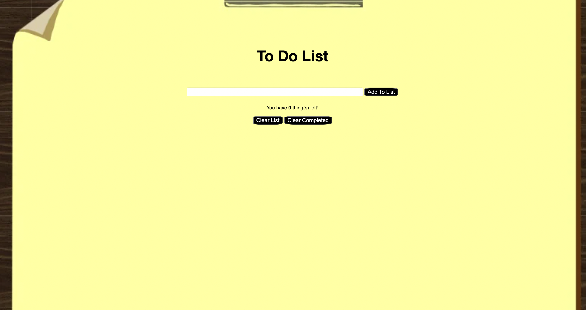

<h1>To-Do List</h1>

This simple to-do list allows the user to add tasks. The user can then choose to clear all tasks or clear the completed tasks.

Link to project:<a href>https://sharp-leakey-745d06.netlify.app</a>

<h2>How It's Made:</h2>

Tech used: HTML, CSS, and JavaScript

 To begin I first pseduo coded what the user should see which included a form and 3 buttons. Next I focused on getting the buttons to work and properly remove the targeted items. I did this by adding classes to each element and then removing the  classes. I lastly added a portion of css which allows the user to click on the added to-do item and show a line-through that item.

<h2>Lessons Learned:</h2>

 This lesson has taught me how to properly execute appendChild within a function. 
